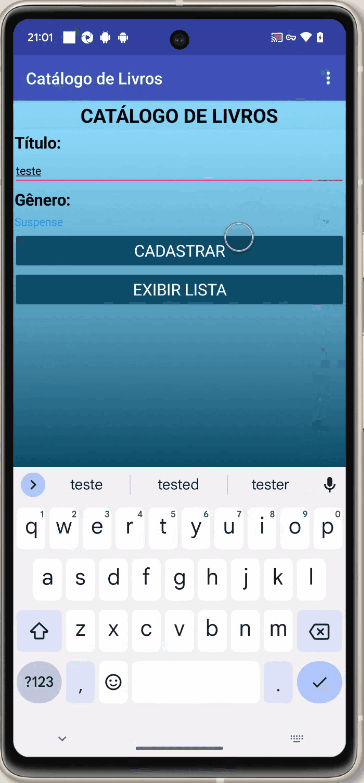
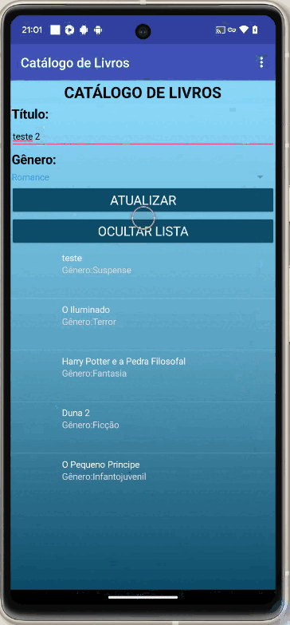
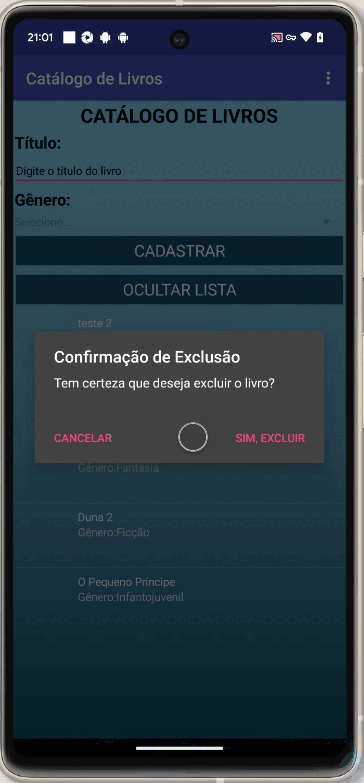

# 📚 Catálogo de Livros

App Android de gerenciamento de livros com CRUD completo integrado ao Firebase Realtime Database, desenvolvido com a plataforma low-code **Kodular**.

---

## 📱 Demonstração

---

## 📖 Sobre o projeto

O **Catálogo de Livros** é uma prática da disciplina **Fundamentos de Design de Sistemas** (UNINTER). Em aula foram desenvolvidas as funcionalidades de cadastro e listagem de livros com conexão ao Firebase, onde os gêneros disponíveis são carregados dinamicamente do banco de dados.

De forma independente, foram implementadas as funcionalidades de **edição** e **exclusão**, completando o ciclo CRUD, além de melhorias de usabilidade como validação de campos, diálogos de confirmação e mensagens de feedback em todas as operações.

---

## ✨ Funcionalidades

- 📝 **Cadastrar** livro com título e gênero
- 📋 **Listar** livros salvos (exibir/ocultar)
- ✏️ **Editar** título ou gênero de um livro existente
- 🗑️ **Excluir** livro com diálogo de confirmação
- 🏷️ **Gêneros** carregados dinamicamente do Firebase
- ⚠️ **Validação** de campos obrigatórios antes de salvar
- 💬 **Mensagens** de sucesso e erro em todas as ações

---

## 🖼️ Fluxos principais

|                Cadastrar                |              Editar               |               Excluir               |
| :-------------------------------------: | :-------------------------------: | :---------------------------------: |
|  |  |  |

---

## 🧱 Lógica do app (blocos)

---

## 🗂️ Documentação

A documentação completa está organizada na pasta [`docs/`](docs/):

| Categoria    | Artefatos                                                                                                                                                                                                                          |
| ------------ | ---------------------------------------------------------------------------------------------------------------------------------------------------------------------------------------------------------------------------------- |
| Requisitos   | [Histórias de Usuário](docs/1-requirements/1-user-stories.md) · [Funcionais](docs/1-requirements/2-functional.md) · [Não Funcionais](docs/1-requirements/3-non-functional.md) · [Casos de Uso](docs/1-requirements/4-use-cases.md) |
| Planejamento | [Kanban / Sprint Board](docs/2-planning/kanban.md)                                                                                                                                                                                 |
| Modelagem    | [Estrutura Firebase](docs/3-modeling/1-classes.md)                                                                                                                                                                                 |
| Arquitetura  | [Visão Geral](docs/4-architecture/1-overview.md) · [Decisões (ADRs)](docs/4-architecture/2-decisions.md)                                                                                                                           |

---

## 🧠 Conceitos explorados

Este projeto documenta os seguintes conceitos na pasta [`concepts/`](concepts/):

| Conceito                                                                | Descrição resumida                                   |
| ----------------------------------------------------------------------- | ---------------------------------------------------- |
| [CRUD](concepts/crud.md)                                                | As 4 operações fundamentais de persistência de dados |
| [Banco de Dados em Tempo Real](concepts/firebase-realtime-database.md)  | Firebase como banco NoSQL sincronizado em nuvem      |
| [Programação por Blocos](concepts/block-programming.md)                 | Lógica construída com blocos visuais no Kodular      |
| [Desenvolvimento Low-Code](concepts/low-code-development.md)            | Criação de apps sem escrever código tradicional      |
| [Validação de Formulário](concepts/form-validation.md)                  | Verificação de campos antes de processar dados       |
| [Componentes de Interface Mobile](concepts/mobile-ui-components.md)     | Spinner, ListView, ChooseDialog e outros             |
| [Feedback ao Usuário](concepts/user-feedback.md)                        | Mensagens e diálogos para orientar o usuário         |
| [Variáveis Globais](concepts/global-variables.md)                       | Estado compartilhado entre blocos de eventos         |
| [Lógica Condicional](concepts/conditional-logic.md)                     | Estruturas if/else para controle de fluxo            |
| [Programação Orientada a Eventos](concepts/event-driven-programming.md) | Fluxo guiado por eventos de UI e Firebase            |

> Os arquivos contêm explicações detalhadas e exemplos extraídos do projeto.

---

## 🛠️ Tecnologias

- [Kodular](https://www.kodular.io/) — plataforma low-code para apps Android
- [Firebase Realtime Database](https://firebase.google.com/products/realtime-database) — banco de dados NoSQL em tempo real

---

_G. Pegado · ADS — UNINTER · 2025_
