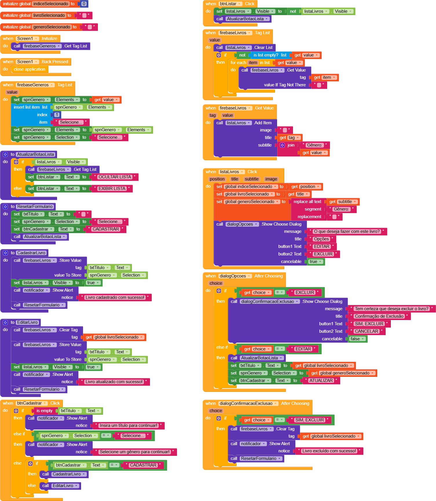

# 🧩 Programação por Blocos (Block Programming)

## 💡 O que é

A **programação por blocos** é um paradigma de desenvolvimento no qual a lógica do programa é construída encaixando blocos visuais em vez de escrever código textual. Cada bloco representa uma instrução, condição, operação ou evento — e eles se conectam como peças de quebra-cabeça, formando sequências lógicas que o sistema executa.

Esse modelo elimina erros de sintaxe e torna a lógica de programação visualmente compreensível, o que a torna especialmente útil para aprendizado e prototipação rápida. Ferramentas como Scratch, App Inventor e Kodular popularizaram essa abordagem no contexto educacional e mobile.

## ⚙️ Como é usado neste projeto

Todo o comportamento do app **Catálogo de Livros** é definido por blocos no **Kodular**. Não há nenhum arquivo de código-fonte tradicional — a lógica vive inteiramente no ambiente visual da plataforma.

Os blocos são organizados em **eventos** (o que dispara a ação) e **ações** (o que acontece), com suporte a condicionais, loops e variáveis globais:

- Eventos: `when btnCadastrar.Click`, `when listaLivros.Click`, `when bdListar.Tag List`
- Condicionais: `if / else if / else` para validar campos e controlar o fluxo
- Loops: `for each item in list` para iterar sobre os livros retornados do Firebase
- Variáveis globais: `livroSelecionado`, `generoSelecionado`, `indiceSelecionado`

## 🔍 Exemplo do projeto

```
// Lógica de cadastro representada como pseudocódigo dos blocos

when btnCadastrar.Click
  if is empty txtTitulo.Text
    then call Avisos.Show Alert "Insira um título para continuar!"
  else if spnGenero.Selection = "Selecione..."
    then call Avisos.Show Alert "Selecione um gênero para continuar!"
  else
    if btnCadastrar.Text = "CADASTRAR"
      then call bdCadastrar.Store Value (tag=título, value=gênero)
    else
      call bdCadastrar.Store Value (tag=livroSelecionado, value=gênero)
```



## 📚 Recursos para aprofundamento

- [Kodular — Documentação oficial](https://docs.kodular.io/) — referência de todos os componentes e blocos
- [MIT App Inventor — Block Programming](https://appinventor.mit.edu/) — plataforma de origem do paradigma de blocos para mobile
