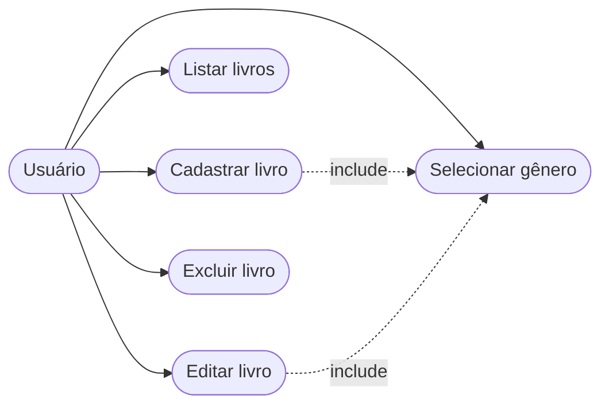

# 🔄 Casos de Uso

## 👥 Atores

| Ator    | Descrição                                                        |
| ------- | ---------------------------------------------------------------- |
| Usuário | Pessoa que utiliza o app para gerenciar seu catálogo de livros   |
| Firebase| Banco de dados em nuvem que armazena livros e gêneros            |

## 📋 Casos de Uso (UC)

| ID   | Caso de Uso          | Ator Principal | Descrição                                      |
| ---- | -------------------- | -------------- | ---------------------------------------------- |
| UC01 | Cadastrar livro      | Usuário        | Preenche título e gênero e salva no Firebase   |
| UC02 | Listar livros        | Usuário        | Exibe ou oculta a lista de livros cadastrados  |
| UC03 | Editar livro         | Usuário        | Altera título ou gênero de um livro existente  |
| UC04 | Excluir livro        | Usuário        | Remove um livro do catálogo após confirmação   |
| UC05 | Selecionar gênero    | Usuário        | Escolhe um gênero carregado dinamicamente      |

---

## 🛣️ Fluxos de Execução

### 📑 UC01 — Cadastrar livro

**Pré-condição:** App aberto e conectado ao Firebase

**🟢 Fluxo principal:**
1. Usuário digita o título do livro
2. Usuário seleciona um gênero no Spinner
3. Usuário toca em CADASTRAR
4. Sistema salva o livro no Firebase
5. Lista é atualizada e mensagem de sucesso é exibida

**🟡 Fluxo alternativo — título vazio:**
1. Usuário toca em CADASTRAR sem preencher o título
2. Sistema exibe alerta "Insira um título para continuar!"

**🟡 Fluxo alternativo — gênero não selecionado:**
1. Usuário toca em CADASTRAR com "Selecione..." ainda ativo
2. Sistema exibe alerta "Selecione um gênero para continuar!"

**✅ Pós-condição:** Livro salvo no Firebase e visível na lista

---

### 📑 UC02 — Listar livros

**Pré-condição:** App aberto e conectado ao Firebase

**🟢 Fluxo principal:**
1. Usuário toca em EXIBIR LISTA
2. Sistema busca os livros no Firebase e preenche a lista
3. Botão muda para OCULTAR LISTA

**🟡 Fluxo alternativo — ocultar lista:**
1. Usuário toca em OCULTAR LISTA
2. Lista é ocultada e botão volta a EXIBIR LISTA

**✅ Pós-condição:** Lista visível ou oculta conforme ação do usuário

---

### 📑 UC03 — Editar livro

**Pré-condição:** Lista visível com ao menos um livro cadastrado

**🟢 Fluxo principal:**
1. Usuário toca em um livro da lista
2. Sistema exibe diálogo com opções EDITAR e EXCLUIR
3. Usuário escolhe EDITAR
4. Campos são preenchidos com título e gênero do livro
5. Botão muda para ATUALIZAR
6. Usuário altera os dados desejados
7. Usuário toca em ATUALIZAR
8. Sistema sobrescreve os dados no Firebase
9. Mensagem de sucesso é exibida

**🔴 Fluxo de exceção — campos inválidos:**
1. Usuário toca em ATUALIZAR com título vazio ou gênero não selecionado
2. Sistema exibe alerta correspondente ao campo inválido

**✅ Pós-condição:** Livro atualizado no Firebase e lista refletindo os novos dados

---

### 📑 UC04 — Excluir livro

**Pré-condição:** Lista visível com ao menos um livro cadastrado

**🟢 Fluxo principal:**
1. Usuário toca em um livro da lista
2. Sistema exibe diálogo com opções EDITAR e EXCLUIR
3. Usuário escolhe EXCLUIR
4. Sistema exibe confirmação: "Tem certeza que deseja excluir o livro?"
5. Usuário confirma com SIM, EXCLUIR
6. Sistema remove o livro do Firebase
7. Lista é atualizada e mensagem de sucesso é exibida

**🟡 Fluxo alternativo — cancelar exclusão:**
1. Usuário escolhe CANCELAR na confirmação
2. Nenhuma alteração é feita

**✅ Pós-condição:** Livro removido do Firebase e da lista exibida

---

### 📑 UC05 — Selecionar gênero

**Pré-condição:** App inicializado e gêneros carregados do Firebase

**🟢 Fluxo principal:**
1. Usuário toca no Spinner de gênero
2. Sistema exibe lista com todos os gêneros + "Selecione..." no topo
3. Usuário escolhe um gênero
4. Spinner exibe o gênero selecionado

**✅ Pós-condição:** Gênero válido selecionado e disponível para cadastro/edição
