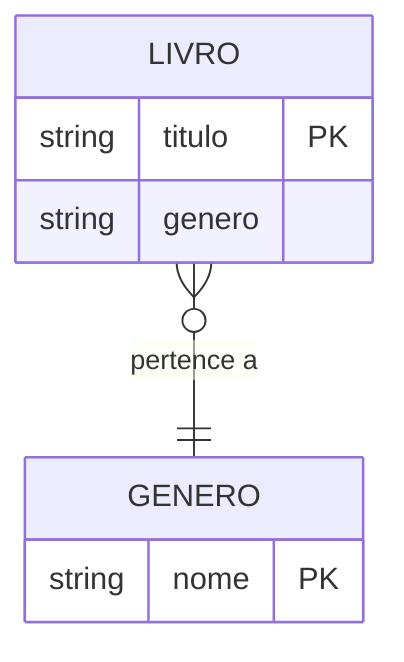

# 🗄️ Modelagem de Dados — Firebase Realtime Database

> O app utiliza o **Firebase Realtime Database** como banco de dados NoSQL em nuvem.  
> Os dados são organizados em uma estrutura JSON em árvore, sem tabelas relacionais.

---

## 📦 Entidades

### Livro

Representa um livro cadastrado no catálogo.

| Campo  | Tipo   | Descrição                                 |
| ------ | ------ | ----------------------------------------- |
| tag    | String | Título do livro (usado como chave no Firebase) |
| value  | String | Gênero selecionado pelo usuário           |

### Gênero

Representa uma categoria literária disponível para seleção.

| Campo | Tipo   | Descrição                                |
| ----- | ------ | ---------------------------------------- |
| tag   | String | Nome do gênero (ex: Ficção, Terror)      |

---

## 🌳 Estrutura JSON no Firebase

```json
{
  "bdCadastrar": {
    "O Iluminado": "Terror",
    "Duna": "Ficção",
    "Harry Potter e a Pedra Filosofal": "Fantasia",
    "O Pequeno Príncipe": "Infantojuvenil",
    "Teste": "Biografia"
  },
  "bdGeneros": {
    "Suspense": "Suspense",
    "Autoajuda": "Autoajuda",
    "Infantojuvenil": "Infantojuvenil",
    "Ficção": "Ficção",
    "Romance": "Romance",
    "Biografia": "Biografia",
    "História": "História",
    "Policial": "Policial",
    "Fantasia": "Fantasia",
    "Terror": "Terror"
  }
}
```

> [!NOTE]
> No Firebase Realtime Database, a **tag** funciona como chave única do registro. No `bdCadastrar`, o título do livro é a tag e o gênero é o valor armazenado. Isso significa que dois livros com o mesmo título se sobrescreveriam — uma limitação conhecida desta implementação.

---

## 🔗 Componentes Firebase no Kodular

| Componente     | Nó no Firebase | Operação                                  |
| -------------- | -------------- | ----------------------------------------- |
| `bdGeneros`    | `bdGeneros/`   | Get Tag List — lista todos os gêneros     |
| `bdCadastrar`  | `bdCadastrar/` | Store Value — salva livro pelo título     |
| `bdCadastrar`  | `bdCadastrar/` | Clear Tag — remove livro pelo título      |
| `bdListar`     | `bdCadastrar/` | Get Tag List + Get Value — lista livros   |

---

## 📊 Diagrama de entidades


