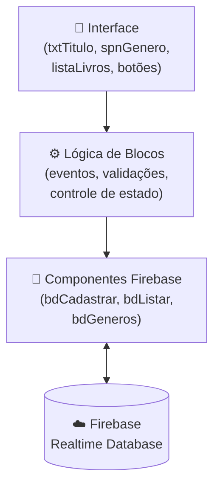
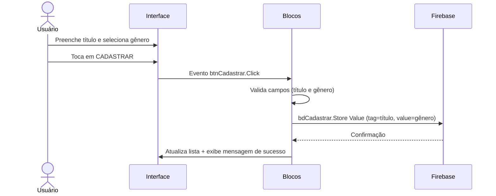

# 🏛️ Visão Geral da Arquitetura

## 📐 Estilo arquitetural

O app **Catálogo de Livros** segue uma arquitetura **cliente-nuvem** simples:

- **Cliente:** app Android gerado pelo Kodular, com interface e lógica definidas em blocos visuais
- **Nuvem:** Firebase Realtime Database, responsável por armazenar e sincronizar os dados em tempo real

Não há servidor intermediário (backend próprio). O app se comunica diretamente com o Firebase via SDK integrado ao Kodular.

---

## 🗂️ Camadas / Módulos

| Camada              | Responsabilidade                                            | Componentes principais                     |
| ------------------- | ----------------------------------------------------------- | ------------------------------------------ |
| Interface (UI)      | Exibir formulário, lista e diálogos ao usuário              | `txtTitulo`, `spnGenero`, `listaLivros`, botões |
| Lógica de negócio   | Validar campos, controlar estado e acionar Firebase         | Blocos de evento (`when btnCadastrar.Click`, etc.) |
| Acesso a dados      | Ler e gravar dados no Firebase Realtime Database            | `bdCadastrar`, `bdListar`, `bdGeneros`     |
| Banco de dados      | Armazenar livros e gêneros em estrutura JSON sincronizada   | Firebase Realtime Database (nuvem)         |

---

## 📊 Diagrama de componentes

---

## 🔄 Fluxo de dados — Cadastro

---

## 📦 Padrões adotados

| Padrão                    | Onde é aplicado                                                       |
| ------------------------- | --------------------------------------------------------------------- |
| Event-Driven              | Toda a lógica é acionada por eventos de componentes (Click, After Choosing, Tag List) |
| Guard Clause              | Validações de campo checadas no início do bloco de cadastro antes de prosseguir |
| State via Global Variables| `livroSelecionado`, `generoSelecionado`, `indiceSelecionado` guardam o contexto da seleção |
| Feedback imediato         | Mensagens de sucesso/erro exibidas após cada operação                |
